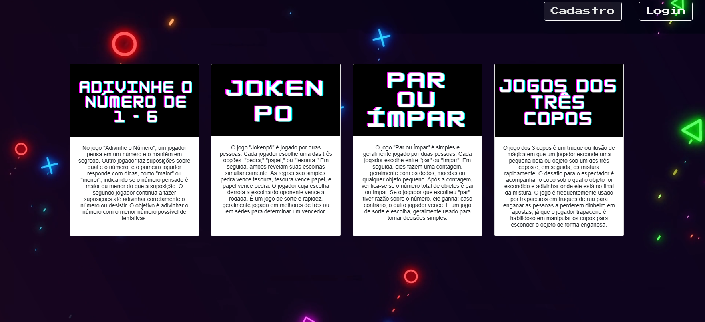

# portalJogos-PHP
um projeto de PHP com CSS, estilo, sistema de cadastro e login protegido, com área do administrador, banco de dados, 4 jogos e ranking.
 

  <h3>Página Inicial sem estar logado</h3>
  

 

  <h3>Página de cadastro. Tem validação</h3>
  

 

  <h3>Página de Login</h3>
  

 

  <h3>Página quando alguém tenta entrar em jogo sem estar logado</h3>
  

 

  <h3>Página inicial logado com ADM</h3>
  

 

  <h3>Página do ADM para aceitar cadastros no banco de dados</h3>
  

 

  <h3>Página dos cadastrados (exclusivo do ADM)</h3>
  

 

  <h3>Página do jogo Adivinhe um número de 1 a 6</h3>
  

 

  <h3>Resultado do jogo e página que registra os pontos no banco de dados</h3>
  

 

  <h3>Página do Jokenpô. Imagens clicáveis</h3>
  

 

  <h3>Resultado do jogo</h3>
  

 

  <h3>Página do Par ou ímpar</h3>
  

 

  <h3>Resultado do jogo</h3>
  

 

  <h3>Página do Jogo dos 3 Copos</h3>
  

 

  <h3>Resultado se derrota</h3>
  

 

  <h3>Resultado se vitória</h3>
  

 

  <h3>Ranking</h3>
  

 

  <h3>Página de um jogo enquanto logado como usuário normal</h3>
  

 
